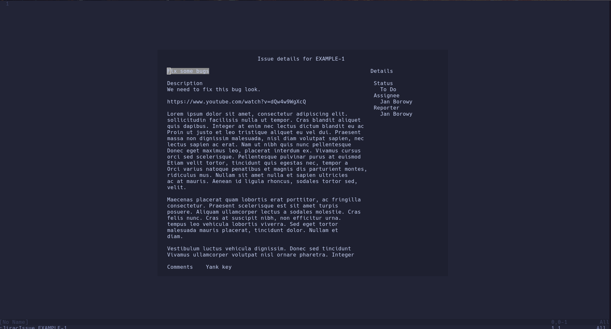
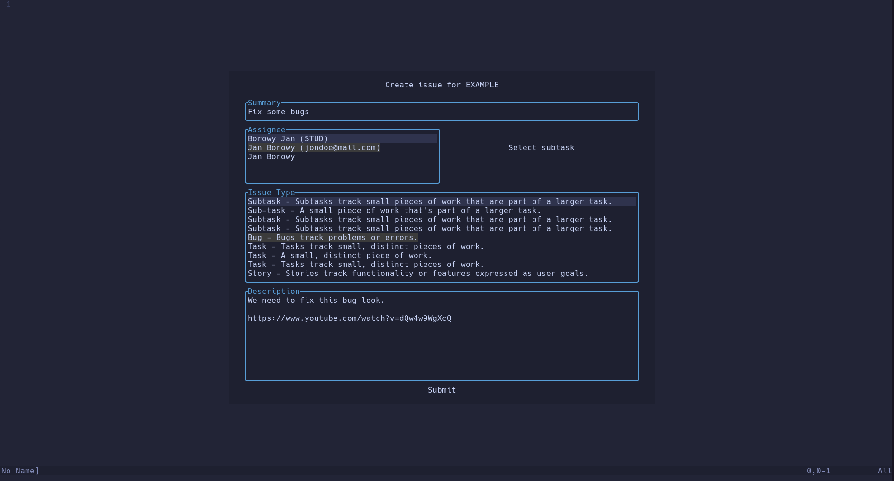
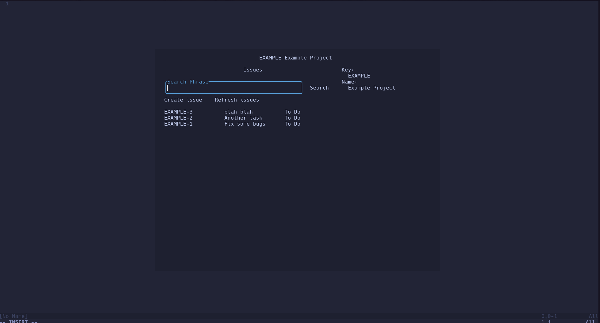
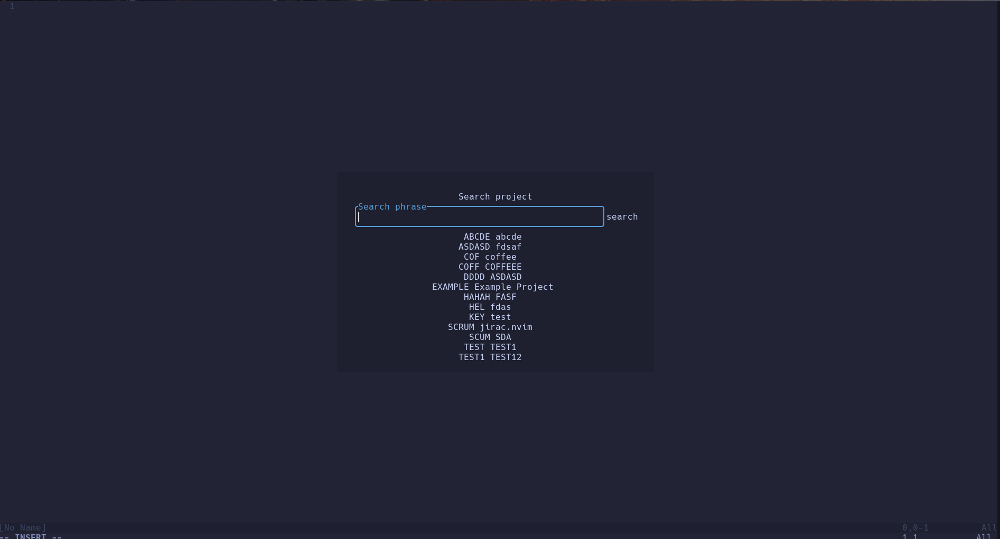

# jirac.nvim [](https://github.com/your/your-project/blob/master/LICENSE)

JiraC is a Jira Cilent built into Neovim. Plugin provides simple Jira functionality so
developers can browse and edit tasks inside their editor. Jirac uses
[nui-components.nvim](https://github.com/grapp-dev/nui-components.nvim) to provide
user-friendly interface.

* [Features](#features)
* [Requirements](#requirements)
* [Installation](#installation)
* [Usage](#usage)
* [Configuration](#configuration)
* [Known Issues](#known-issues)
* [Future](#future)


## <a name="features">Features</a>
* Browse projects and project's details
* Browse issues and issue's details
* Easily edit issues
* Browse and manipulate an issue's comments

## <a name="requirements">Requirements</a>
* [Neovim](https://neovim.io/) - tested on >= 0.10.1
* [plenary.nvim](https://github.com/nvim-lua/plenary.nvim) - for "plenary.curl"
* [nui-components.nvim](https://github.com/grapp-dev/nui-components.nvim) - for UI
* [nui.nvim](https://github.com/grapp-dev/nui-components.nvim) - dependency of nui-components.nvim

## <a name="installation">Installation</a>
Install using your favorite plugin manager:

[Lazy](https://github.com/folke/lazy.nvim)
```lua
{
    "janBorowy/jirac.nvim"
        dependencies = {
            "MunifTanjim/nui.nvim",
            "grapp-dev/nui-components.nvim",
            "nvim-lua/plenary.nvim"
        }
}
```

[Packer](https://github.com/wbthomason/packer.nvim)
```lua
use {
    "janBorowy/jirac.nvim",
        requires = {
            "MunifTanjim/nui.nvim",
            "grapp-dev/nui-components.nvim",
            "nvim-lua/plenary.nvim"
        }
}
```

## <a name="usage">Usage</a>

`:JiracIssue <issue_key> [<project_key>]`

Open the issue panel. Use it to browse, modify and transition issues.
`<issue_key>` must be an exact issue's key.
If no project_key is specified, `<default_project_key>` will be used.



`:JiracIssueSearch <search_phrase> [<project_key>]`

Search for an issue containing `<search_phrase>` in its summary or description.

`:JiracIssueCreate [<project_key>]`

Open issue submit panel.


`:JiracJql <jql>`

Search for an issues using `<jql>`. [More about JQL.](https://www.atlassian.com/software/jira/guides/jql/overview#what-is-jql)

`:JiracProject [<project_key>]`

Open the project panel of a project specified by the `<project_key>` argument or
`<default_project_key>` if none is specified.



`:JiracProjectSearch <search_phrase>`

Search for a project using `<search_phrase>`



`:JiracShow`

Opens last closed panel

## <a name="configuration">Configuration</a>

### Setup

Configure using `setup` function:

```lua
require("jirac").setup({
    email = "<your_atlassian_account_email>",
    jira_domain = "<your_jira_domain>",
    api_key = "<secret_api_key>",
    config = {
        default_project_key = "<default_project_key>"
    }
})
```

Example config:

```lua
require("jirac").setup({
    email = "foobar@mail.com",
    jira_domain = "developer.atlassian.net",
    api_key = io.open(os.getenv("HOME") .. "/personal/jira_token.txt"):read("*a"),
    config = {
        default_project_key = "WD"
    }
})
```

### Nui-components highlighting
Nui-components also uses its own highlight groups to determine highlighting in places
such as button focus and option selections in selection components. Read more about
highlight group names [here](https://nui-components.grapp.dev/docs). It is recommended
to set highlight groups for option selections and button components:

```lua
vim.api.nvim_set_hl(0, "NuiComponentsSelectOptionSelected", {
    bg = "#3B3B3B"
})

vim.api.nvim_set_hl(0, "NuiComponentsButtonFocused", {
    bg = "#8D8D8D"
})
```

### Handling signals
Sometimes an issue might be edited by multiple people at the same time, resulting
in stale data shown on panels, which have been opened before an edit. To overcome
this issue, one might use jirac signals:

```lua
require("jirac.api").send_signal("issue_updated")
```

Signals supported:
- `issue_updated`
- `issue_created`

The behaviour these signals have varies depending on the panel user is in.

Jira API does expose [webhooks](https://developer.atlassian.com/server/jira/platform/webhooks/) to listen for incoming change, such as issue creation
or edition. Unfortunately, webhooks are intended for server to server communication
and are not suitable to be used directly by a plugin.

A user can set up a [webhook relay](https://docs.webhookrelay.com/), use
a websocket to communicate with it and send Jirac signals based on response.
**As of right now, I could not find a suitable plugin to use websockets with Neovim.**

Alternatively one can send signals using some constant interval, minizing
this issue.

## <a name="known-issues">Known Issues</a>
- Issue submit for Company-managed software/business project types fails, because
these project do not contain issues.
- Project needs better ADF support - conversion may sometimes fail

## <a name="future">Future</a>
- Better ADF support
- Ability to open IssuePanel while viewing some buffer with issue key in it
- Navigate panels using shortcuts
